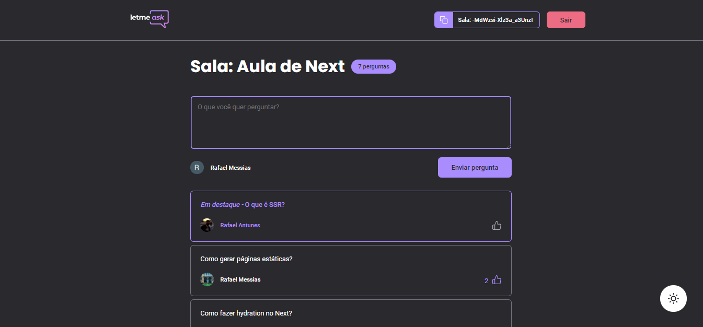
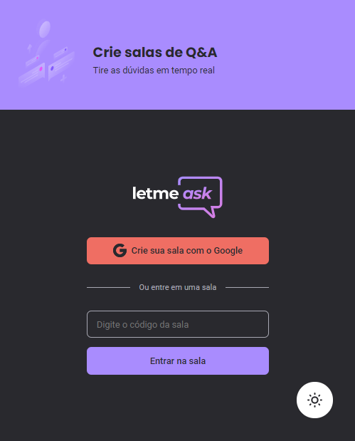
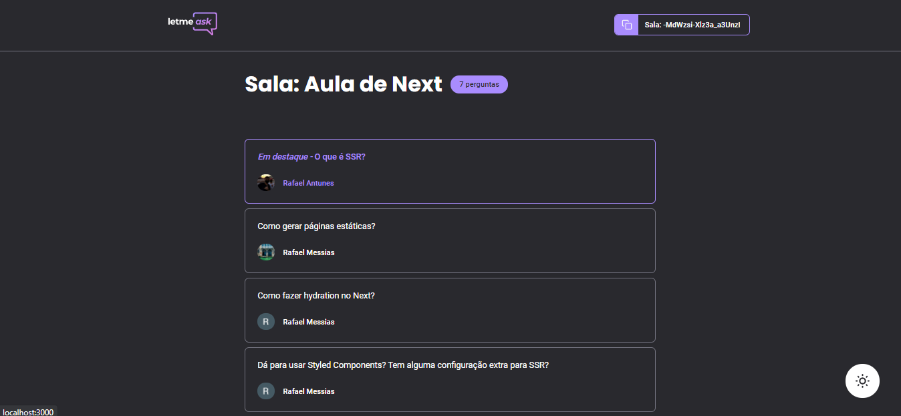
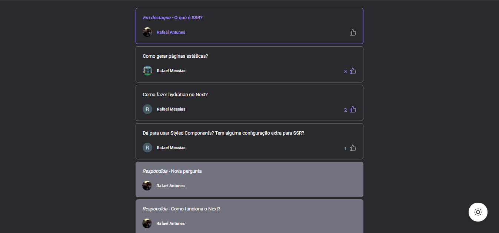

# O próximo nível do Letmeask

Projeto da trilha de React do Next Level Week Together (6).

## Tecnologias utilizadas

- React
- Typescript
- Context API
- Styled Components

## Como deixei no próximo nível:

As principais diferenças entre projeto na última aula são:

### Dark Mode

### Responsividade

### Admin Room

Limitação das ações que somente o administrador da sala pode executar para outros usuários.

### Perguntas devidamente organizadas

Primeiro vêm as perguntas `em destaque`, depois as perguntas `com mais likes`, e então as `já respondidas`.

